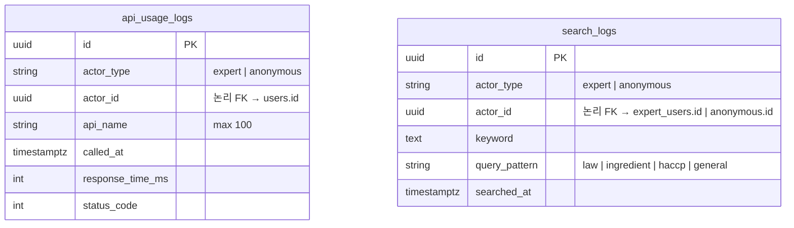
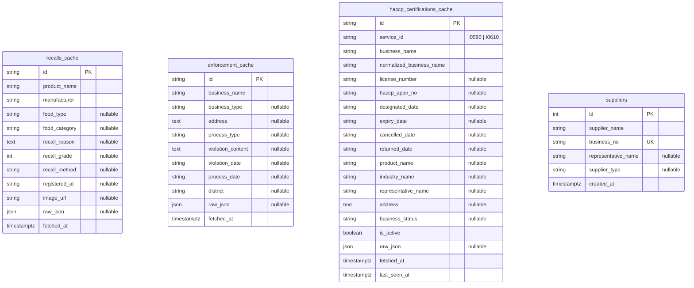
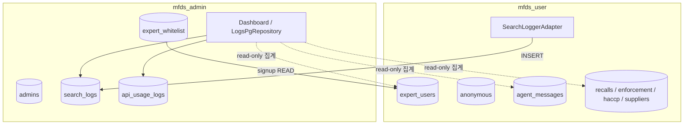

# MFDS Backend ERD (통합 SSOT)

> **앱별 상세 (코드 기준):**
> - User: [`backend/apps/mfds_user/_docs/mfds-erd.md`](../apps/mfds_user/_docs/mfds-erd.md)
> - Admin: [`backend/apps/mfds_admin/_docs/mfds-admin-erd.md`](../apps/mfds_admin/_docs/mfds-admin-erd.md)

본 문서는 MFDS 백엔드 **전체 테이블·관계·앱 경계**의 통합 사양서입니다.  
구현 SSOT는 각 앱의 ORM (`adapter/outbound/orm/`) 및 `db_init.py` 입니다.

| 앱 | 테이블 생성 | ORM 스택 |
|----|-------------|----------|
| `mfds_user` | `create_user_tables` | SQLAlchemy `Base` (계정·에이전트·리포트) + SQLModel (식품안전 캐시·`suppliers`) |
| `mfds_admin` | `create_admin_tables` | SQLAlchemy (admin·whitelist·observability) |

---

## 1. 통합 관계 다이어그램

### 1.1 계정 · 상속 · 에이전트 · 리포트

**Joined Table Inheritance:** `users`가 부모, `admins` / `expert_users` / `anonymous`가 자식.  
자식 PK 컬럼명은 모두 **`id`** (`= users.id`, PK + FK).

```mermaid
erDiagram
    users ||--|| admins : "1:1 inherits"
    users ||--|| expert_users : "1:1 inherits"
    users ||--|| anonymous : "1:1 inherits"

    admins ||--o{ expert_whitelist : "registers"

    users ||--o{ agent_sessions : "actor_id FK"
    expert_users ||--o{ expert_user_sessions : "has"
    agent_sessions ||--o{ agent_messages : "contains"
    agent_messages ||--o{ agent_message_sources : "has"

    agent_messages ||--o{ satisfaction_feedbacks : "message_id 논리참조"
    agent_messages ||--o{ expert_feedbacks : "message_id 논리참조"
    expert_users ||--o{ expert_feedbacks : "labels"

    industry_category ||--o{ industry_category : "parent_code self-FK"
    industry_category ||--o{ category_keywords : "has"
    expert_users ||--o{ expert_user_industry : "selects"
    industry_category ||--o{ expert_user_industry : "category_code FK"

    expert_users ||--o{ daily_report : "has"
    daily_report ||--o{ report_feedback : "has"
    expert_users ||--o{ report_feedback : "submits"
    report_feedback ||--o{ report_feedback_sections : "has"

    users {
        uuid id PK
        string user_type "admin | expert | anonymous"
        timestamptz created_at
    }

    admins {
        uuid id PK_FK "FK users.id ON DELETE CASCADE"
        string email UK
        string name
        string hashed_password
        timestamptz last_login "nullable"
    }

    expert_users {
        uuid id PK_FK "FK users.id ON DELETE CASCADE"
        string email UK
        string name "nullable"
        string picture "nullable"
        string auth_provider "google | email"
        string hashed_password "nullable"
        timestamptz last_login "nullable"
    }

    expert_user_sessions {
        uuid id PK
        uuid expert_user_id FK "expert_users.id CASCADE"
        string access_token
        string refresh_token
        timestamptz created_at
        timestamptz expires_at
    }

    anonymous {
        uuid id PK_FK "FK users.id ON DELETE CASCADE"
        string cookie_id UK
        timestamptz last_seen
    }

    expert_whitelist {
        string email PK
        string invited_name "nullable"
        string role_desc "nullable"
        uuid added_by FK "FK admins.id ON DELETE CASCADE"
        timestamptz added_at
    }

    agent_sessions {
        uuid id PK
        uuid actor_id FK "users.id CASCADE"
        timestamptz started_at
        timestamptz last_active_at
    }

    agent_messages {
        uuid id PK
        uuid session_id FK "agent_sessions.id CASCADE"
        string role "user | assistant"
        string query_pattern "law | ingredient | haccp | general"
        text content
        timestamptz created_at
    }

    agent_message_sources {
        uuid id PK
        uuid message_id FK "agent_messages.id CASCADE"
        text source_url
    }

    satisfaction_feedbacks {
        uuid id PK
        uuid message_id "FK dropped — 논리 참조"
        boolean is_positive
        timestamptz submitted_at
    }

    expert_feedbacks {
        uuid id PK
        uuid message_id "FK dropped — 논리 참조"
        uuid expert_user_id FK "expert_users.id CASCADE"
        string label "correct | partial | incorrect"
        text memo "nullable"
        timestamptz submitted_at
    }

    industry_category {
        string code PK
        string type "media | foodtype"
        string parent_code FK "nullable self-ref CASCADE"
        int2 depth
        boolean is_flat
        string name_ko
        string crawler_param "nullable"
        timestamptz created_at
    }

    category_keywords {
        uuid id PK
        string category_code FK "industry_category.code CASCADE"
        string keyword
    }

    expert_user_industry {
        uuid id PK
        uuid expert_user_id FK "expert_users.id CASCADE"
        string category_code FK "industry_category.code CASCADE"
        timestamptz created_at
    }

    daily_report {
        uuid id PK
        uuid expert_user_id FK "expert_users.id CASCADE"
        date report_date
        timestamptz generated_at
        timestamptz expires_at
        boolean is_saved
        text summary
        string summary_preview "max 150"
        jsonb raw_news
        jsonb raw_recalls
        jsonb raw_laws
        jsonb raw_mfds
        jsonb raw_research
        jsonb raw_stats
        jsonb raw_risk
    }

    report_feedback {
        uuid id PK
        uuid report_id FK "daily_report.id CASCADE"
        uuid expert_user_id FK "expert_users.id CASCADE"
        timestamptz created_at
        text content_feedback "nullable"
        text missing_feedback "nullable"
        text improvement_feedback "nullable"
        int2 usefulness_score
    }

    report_feedback_sections {
        uuid id PK
        uuid feedback_id FK "report_feedback.id CASCADE"
        string section_type "NEWS | RECALL | LAW | MFDS | RISK | RESEARCH | STATS"
    }

    report_feedback_analysis {
        uuid id PK
        string industry_code "논리 FK — DB FK 없음"
        timestamptz analyzed_at
        int4 feedback_count
        date period_start
        date period_end
        jsonb missing_topics
        jsonb improvement_keys
        jsonb useful_sections
        text summary
        jsonb action_items
    }
```

### 1.2 Observability (Admin 소유)

다형 행위자 패턴: **`actor_type` + `actor_id`** — 물리 FK 없음.



### 1.3 식품안전 캐시 · 납품사 (User 소유, SQLModel)

공공 API 동기화용 **독립 테이블** — user 계정 FK 없음.



`supplier_interactor`는 recall · enforcement · haccp 캐시를 **이름 매칭 read** — DB FK 없음.

---

## 2. 앱 소유 · Cross-app 경계



| 테이블 | Owner | mfds_user | mfds_admin |
|--------|-------|-----------|------------|
| `users`, `expert_users`, `anonymous`, `agent_*`, `daily_report`, `report_feedback*`, `industry_*` | user | Full CRUD | — |
| `recalls_cache`, `enforcement_cache`, `haccp_certifications_cache`, `suppliers` | user | sync / API | Dashboard read-only |
| `admins` | admin | — | login, JWT |
| `expert_whitelist` | admin | signup **READ** | Full CRUD |
| `search_logs` | admin | **WRITE** (`SearchLoggerAdapter`) | Read (list) |
| `api_usage_logs` | admin | *(write 미구현)* | Read (list / stats / dashboard) |

**논리 연결 (DB FK 없음):**

- `expert_whitelist.email` ↔ `expert_users.email` (가입 게이트)
- Dashboard `users.business` ← `suppliers` COUNT *(도메인 proxy, 임시 집계)*

---

## 3. ORM ↔ 테이블 매핑

| 테이블 | ORM | 앱 | Stack |
|--------|-----|-----|-------|
| `users` | `UserORM` | user | SQLAlchemy |
| `expert_users` | `ExpertUserORM` | user | SQLAlchemy |
| `expert_user_sessions` | `ExpertUserSessionORM` | user | SQLAlchemy |
| `anonymous` | `AnonymousORM` | user | SQLAlchemy |
| `agent_sessions` | `AgentSessionORM` | user | SQLAlchemy |
| `agent_messages` | `AgentMessageORM` | user | SQLAlchemy |
| `agent_message_sources` | `AgentMessageSourceORM` | user | SQLAlchemy |
| `satisfaction_feedbacks` | `SatisfactionFeedbackORM` | user | SQLAlchemy |
| `expert_feedbacks` | `ExpertFeedbackORM` | user | SQLAlchemy |
| `industry_category` | `IndustryCategoryORM` | user | SQLAlchemy |
| `category_keywords` | `CategoryKeywordORM` | user | SQLAlchemy |
| `expert_user_industry` | `ExpertUserIndustryORM` | user | SQLAlchemy |
| `daily_report` | `DailyReportORM` | user | SQLAlchemy |
| `report_feedback` | `ReportFeedbackORM` | user | SQLAlchemy |
| `report_feedback_sections` | `ReportFeedbackSectionORM` | user | SQLAlchemy |
| `report_feedback_analysis` | `ReportFeedbackAnalysisORM` | user | SQLAlchemy |
| `recalls_cache` | `RecallModel` | user | SQLModel |
| `enforcement_cache` | `EnforcementModel` | user | SQLModel |
| `haccp_certifications_cache` | `HaccpCertificationModel` | user | SQLModel |
| `suppliers` | `SupplierModel` | user | SQLModel |
| `admins` | `AdminORM` | admin | SQLAlchemy (extends `UserORM`) |
| `expert_whitelist` | `ExpertWhitelistORM` | admin | SQLAlchemy |
| `api_usage_logs` | `ApiUsageLogORM` | admin | SQLAlchemy |
| `search_logs` | `SearchLogORM` | admin | SQLAlchemy |

**DB persistence 없음:** `regulation` — 외부 API only.

---

## 4. 정규화 및 설계 결정

### 4.1 1NF — 다중값 속성 분리

| 자식 테이블 | 분리 대상 |
|-------------|-----------|
| `agent_message_sources` | `agent_messages.source_urls` (TEXT[]) |
| `category_keywords` | `industry_category.keywords` (TEXT[]) |
| `report_feedback_sections` | `report_feedback.useful_sections` (TEXT[]) |

**1NF 예외:** `daily_report.raw_*` (JSONB) — 외부 스키마 변화 대응을 위한 수집 원문 스냅샷 비정규화.

### 4.2 3NF — Joined Table Inheritance

- `users`: 공통 PK·생성일·`user_type` (polymorphic discriminator).
- `admins` / `expert_users` / `anonymous`: `id` = `users.id` (PK + FK, CASCADE).
- `agent_sessions.actor_id` → `users.id` FK로 다형 행위자를 **물리 FK**로 해소.
- `expert_user_industry`: `category_type` 제거 — `category_code` JOIN으로 타입 조회.

### 4.3 의도적 FK 미적용

| 대상 | 이유 |
|------|------|
| `satisfaction_feedbacks.message_id` | `db_init`에서 FK constraint DROP — 논리 참조 |
| `expert_feedbacks.message_id` | 동일 |
| `report_feedback_analysis.industry_code` | ORM에 ForeignKey 없음 |
| `search_logs` / `api_usage_logs` `actor_id` | expert / anonymous 다형 패턴 |
| `expert_whitelist` ↔ `expert_users` | email 논리 연결 (가입 전·후) |

---

## 5. Admin Dashboard 집계 (Read-only)

`LogsPgRepository`가 user context 테이블을 cross-context read (DB FK 없음).

| Dashboard 필드 | 소스 | 집계 |
|----------------|------|------|
| `users.total` | `expert_users` | `COUNT(*)` |
| `users.active` | `expert_users` | `last_login IS NOT NULL` |
| `users.business` | `suppliers` | `COUNT(*)` *(proxy)* |
| `users.advertiser_pending` | — | 하드코딩 `0` |
| `chats.today_total` | `agent_messages` | 오늘 `created_at` |
| `chats.regulation_total` | `agent_messages` | `query_pattern = law` 세션 수 |
| `chats.analysis_total` | `agent_messages` | `ingredient \| haccp \| general` 세션 수 |
| `api.today_calls/errors/top_api` | `api_usage_logs` | 당일 집계 |

---

## 6. 코드 기준 특이사항

### Joined Table Inheritance

```python
# user_orm.py — polymorphic_on user_type
# admin_orm.py / expert_user_orm.py / anonymous_orm.py — id FK users.id, PK
```

- `user_type`: `"expert"`, `"anonymous"` (user), `"admin"` (admin).
- `AuthPgRepository.save_user` → `ExpertUserORM` insert (부모 `users` row 동시 생성).

### Dual metadata

```python
Base.metadata.create_all      # SQLAlchemy ORM
SQLModel.metadata.create_all  # recalls / enforcement / haccp / suppliers
```

### Feedback FK 제거 (`create_user_tables`)

```sql
ALTER TABLE satisfaction_feedbacks DROP CONSTRAINT IF EXISTS satisfaction_feedbacks_message_id_fkey;
ALTER TABLE expert_feedbacks DROP CONSTRAINT IF EXISTS expert_feedbacks_message_id_fkey;
```

---

## 7. 문서 역할 분담

| 문서 | 범위 |
|------|------|
| **본 문서** (`backend/_docs/mfds-erd.md`) | 전체 테이블·관계·앱 경계·정규화 SSOT |
| [`mfds-erd.md`](../apps/mfds_user/_docs/mfds-erd.md) | user 앱 기능 ↔ 데이터 흐름, router 매핑 |
| [`mfds-admin-erd.md`](../apps/mfds_admin/_docs/mfds-admin-erd.md) | admin API ↔ repository, dashboard 상세 |
