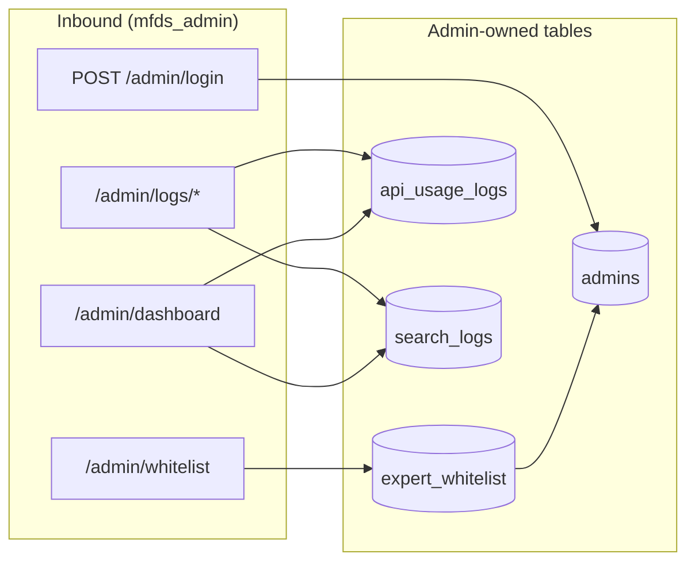
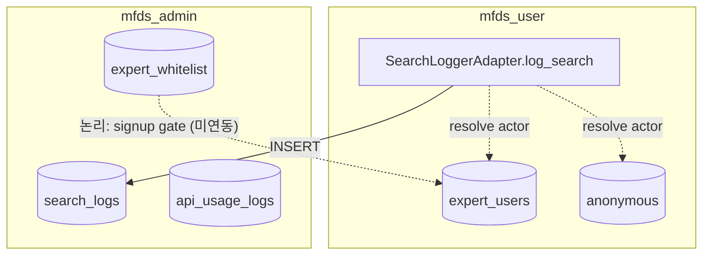

# MFDS Admin ERD (`mfds_admin`)

> **통합 SSOT:** [`backend/_docs/mfds-erd.md`](../../../_docs/mfds-erd.md)  
> **User context:** [`mfds_user/_docs/mfds-erd.md`](../../mfds_user/_docs/mfds-erd.md)

본 문서는 **`backend/apps/mfds_admin/` 코드 기준**으로 작성했습니다.  
ORM: `adapter/outbound/orm/` · 테이블 생성: `adapter/outbound/pg/db_init.py` (`create_admin_tables`)

---

## 1. Admin 소유 테이블 (Persistence)

`AdminORM`은 `mfds_user`의 `UserORM`을 **Joined Table Inheritance** 로 상속합니다.  
`admins.id` = `users.id` (동일 UUID, PK + FK).

```mermaid
erDiagram
    users ||--|| admins : "1:1 inherits"
    admins ||--o{ expert_whitelist : "registers"

    users {
        uuid id PK
        string user_type "polymorphic: admin | expert | anonymous"
        timestamptz created_at
    }

    admins {
        uuid id PK_FK "FK users.id ON DELETE CASCADE"
        string email UK "unique index"
        string name
        string hashed_password
        timestamptz last_login "nullable"
    }

    expert_whitelist {
        string email PK
        string invited_name "nullable"
        string role_desc "nullable"
        uuid added_by FK "FK admins.id ON DELETE CASCADE"
        timestamptz added_at
    }

    api_usage_logs {
        uuid id PK
        string actor_type "expert | anonymous"
        uuid actor_id "논리 FK → users.id"
        string api_name "max 100"
        timestamptz called_at
        int response_time_ms
        int status_code
    }

    search_logs {
        uuid id PK
        string actor_type "expert | anonymous"
        uuid actor_id "논리 FK → expert_users.id | anonymous.id"
        text keyword
        string query_pattern "law | ingredient | haccp | general"
        timestamptz searched_at
    }
```

### ORM ↔ 테이블 매핑

| 테이블 | ORM | `__tablename__` | Admin 앱 CRUD |
|--------|-----|-----------------|---------------|
| `users` | `UserORM` *(mfds_user)* | `users` | Read (상속 부모) |
| `admins` | `AdminORM` | `admins` | Read/Update (`last_login`) |
| `expert_whitelist` | `ExpertWhitelistORM` | `expert_whitelist` | Full CRUD |
| `api_usage_logs` | `ApiUsageLogORM` | `api_usage_logs` | Read (list/stats) |
| `search_logs` | `SearchLogORM` | `search_logs` | Read (list) |

---

## 2. 기능 ↔ 데이터 흐름



| API | Use case | Repository | 테이블 |
|-----|----------|------------|--------|
| `POST /admin/login` | `AdminAuthInteractor` | `AdminPgRepository` | `admins` |
| `GET/POST/DELETE /admin/whitelist` | `WhitelistInteractor` | `WhitelistPgRepository` | `expert_whitelist` |
| `GET /admin/logs/api` | `LogsInteractor` | `LogsPgRepository` | `api_usage_logs` |
| `GET /admin/logs/search` | `LogsInteractor` | `LogsPgRepository` | `search_logs` |
| `GET /admin/dashboard` | `LogsInteractor` | `LogsPgRepository` | 아래 §3 read-only |
| `GET /admin/api-stats` | `LogsInteractor` | `LogsPgRepository` | `api_usage_logs` |

---

## 3. Dashboard · Read-only (mfds_user 테이블)

`LogsPgRepository`가 **admin 소유 테이블이 아닌** user context 테이블을 집계합니다.  
DB FK 없음 — 앱 레벨 cross-context read.

```mermaid
erDiagram
    expert_users ||--o{ agent_messages : "contains via session"
    agent_sessions ||--o{ agent_messages : "contains"

    expert_users {
        uuid id PK_FK "users.id"
        string email UK
        timestamptz last_login "nullable — active 집계"
    }

    agent_messages {
        uuid id PK
        uuid session_id FK
        string query_pattern
        timestamptz created_at
    }

    suppliers {
        int id PK
        string supplier_name
        string business_no UK
    }
```

| Dashboard 필드 | 소스 테이블 | 집계 (`logs_pg_repository`) |
|----------------|-------------|-------------------------------|
| `users.total` | `expert_users` | `COUNT(*)` |
| `users.active` | `expert_users` | `last_login IS NOT NULL` |
| `users.business` | `suppliers` | `COUNT(*)` *(proxy)* |
| `users.advertiser_pending` | — | 하드코딩 `0` |
| `chats.today_total` | `agent_messages` | 오늘 `created_at` |
| `chats.regulation_total` | `agent_messages` | `query_pattern = law` 세션 수 |
| `chats.analysis_total` | `agent_messages` | `ingredient \| haccp \| general` 세션 수 |
| `api.today_calls/errors/top_api` | `api_usage_logs` | 당일 집계 |

---

## 4. Cross-app Write / Read 경계



| 테이블 | Write | Read (admin) |
|--------|-------|--------------|
| `search_logs` | **mfds_user** `SearchLoggerAdapter` | `LogsPgRepository.get_search_logs` |
| `api_usage_logs` | *(repo 내 writer 미구현)* | list / dashboard / api-stats |
| `expert_whitelist` | **mfds_admin** whitelist API | list |
| `admins` | seed/마이그레이션 *(앱 내 signup 없음)* | login, JWT middleware |

---

## 5. 상속 · FK 상세 (코드 기준)

### `AdminORM` → `UserORM`

```python
# admin_orm.py
class AdminORM(UserORM):
    __tablename__ = "admins"
    id: FK("users.id", ondelete="CASCADE"), PK
    __mapper_args__ = {"polymorphic_identity": "admin"}
```

- 통합 ERD의 `admins.user_id` 명칭과 달리, **실제 PK 컬럼명은 `id`** 입니다.
- `users.user_type = "admin"` row와 1:1.

### `ExpertWhitelistORM`

```python
added_by: FK("admins.id", ondelete="CASCADE")
```

- PK: `email` (초대 대상 이메일).
- `POST /admin/whitelist` → JWT `sub` → `added_by`.

### Observability 로그

- **`actor_type` + `actor_id`**: 물리 FK 없음. `SearchLoggerAdapter`가 expert UUID 또는 `anonymous.id`를 기록.
- **`api_usage_logs`**: 스키마·조회만 존재. monorepo 내 INSERT 구현체는 아직 없음.

---

## 6. 정규화 메모

* **`expert_whitelist`**: 초대 메타만 3NF. 가입 후 `expert_users`와 **email로 논리 연결** (DB FK 없음).
* **`search_logs` / `api_usage_logs`**: 다형 행위자 패턴 — 통합 SSOT [§2](../../../_docs/mfds-erd.md) 참조.
* **Dashboard `suppliers` → `users.business`**: 도메인 매핑이 아닌 **임시 집계 proxy** — ERD상 FK 없음.

---

## 7. 앱 구조와 ERD 범위

```
mfds_admin/
├── adapter/outbound/orm/     ← 본 ERD §1 테이블 SSOT
├── adapter/outbound/pg/      ← CRUD · 집계
├── adapter/inbound/api/v1/   ← HTTP (auth, whitelist, dashboard, logs)
└── dependencies/             ← DI (schema → use case 경계는 inbound)
```

**본 ERD에 포함하지 않음:** JWT payload (`AdminTokenPayloadSchema`) — DB 테이블 아님.
