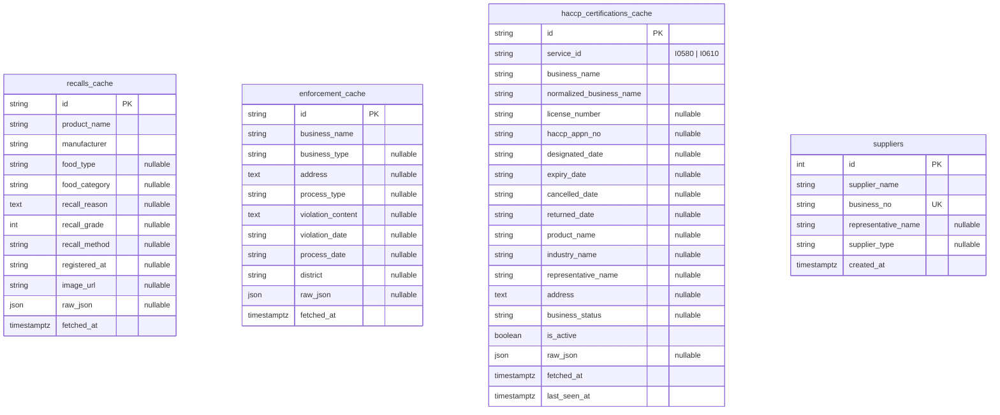
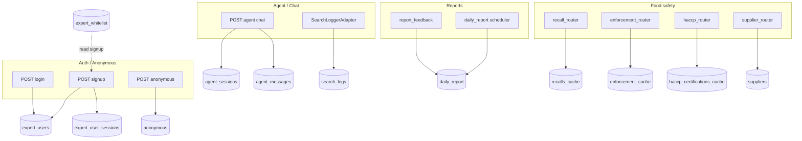
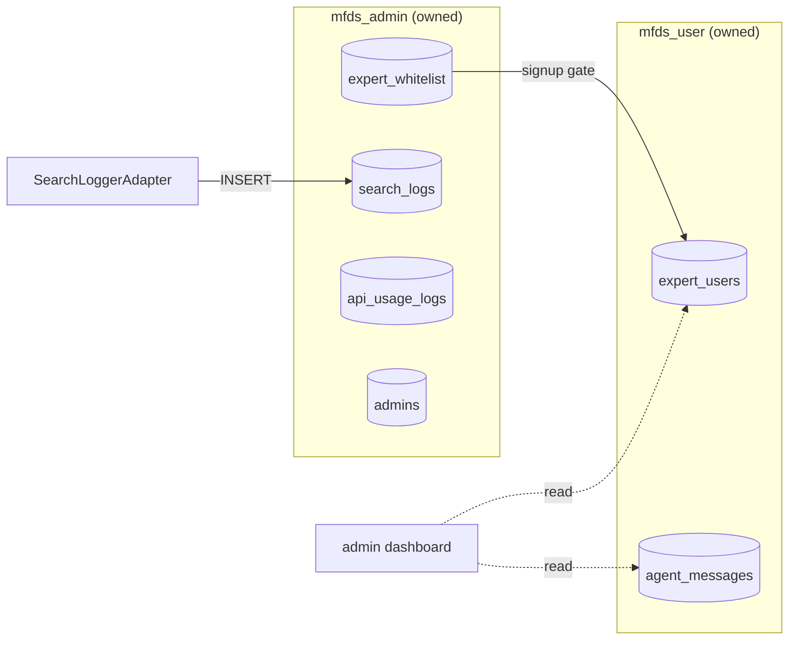

# MFDS User ERD (`mfds_user`)

> **통합 SSOT:** [`backend/_docs/mfds-erd.md`](../../../_docs/mfds-erd.md)  
> **Admin context:** [`mfds_admin/_docs/mfds-admin-erd.md`](../../mfds_admin/_docs/mfds-admin-erd.md)

본 문서는 **`backend/apps/mfds_user/` 코드 기준**으로 작성했습니다.  
ORM: `adapter/outbound/orm/` · 테이블 생성: `adapter/outbound/pg/db_init.py` (`create_user_tables`)

**ORM 스택:** SQLAlchemy `Base` (계정·에이전트·리포트) + **SQLModel** (식품안전 캐시·`suppliers`)

---

## 1. 계정 · 에이전트 · 업종 · 리포트 (Core)

Joined Table Inheritance: `users` 가 부모, `expert_users` / `anonymous` 가 자식 (`user_type` polymorphic).  
PK 컬럼명은 모두 **`id`** (`= users.id`).

```mermaid
erDiagram
    users ||--|| expert_users : "1:1 inherits"
    users ||--|| anonymous : "1:1 inherits"

    users ||--o{ agent_sessions : "actor_id FK"
    expert_users ||--o{ expert_user_sessions : "has"
    agent_sessions ||--o{ agent_messages : "contains"
    agent_messages ||--o{ agent_message_sources : "has"

    agent_messages ||--o{ satisfaction_feedbacks : "message_id no FK"
    agent_messages ||--o{ expert_feedbacks : "message_id no FK"
    expert_users ||--o{ expert_feedbacks : "labels"

    industry_category ||--o{ industry_category : "parent_code self-FK"
    industry_category ||--o{ category_keywords : "has"
    expert_users ||--o{ expert_user_industry : "selects"
    industry_category ||--o{ expert_user_industry : "category_code FK"

    expert_users ||--o{ daily_report : "has"
    daily_report ||--o{ report_feedback : "has"
    expert_users ||--o{ report_feedback : "submits"
    report_feedback ||--o{ report_feedback_sections : "has"

    users {
        uuid id PK
        string user_type "expert | anonymous (+ admin via mfds_admin)"
        timestamptz created_at
    }

    expert_users {
        uuid id PK_FK "FK users.id CASCADE"
        string email UK
        string name "nullable"
        string picture "nullable"
        string auth_provider "google | email"
        string hashed_password "nullable"
        timestamptz last_login "nullable"
    }

    expert_user_sessions {
        uuid id PK
        uuid expert_user_id FK "expert_users.id CASCADE"
        string access_token
        string refresh_token
        timestamptz created_at
        timestamptz expires_at
    }

    anonymous {
        uuid id PK_FK "FK users.id CASCADE"
        string cookie_id UK
        timestamptz last_seen
    }

    agent_sessions {
        uuid id PK
        uuid actor_id FK "users.id CASCADE"
        timestamptz started_at
        timestamptz last_active_at
    }

    agent_messages {
        uuid id PK
        uuid session_id FK "agent_sessions.id CASCADE"
        string role "user | assistant"
        string query_pattern "law | ingredient | haccp | general"
        text content
        timestamptz created_at
    }

    agent_message_sources {
        uuid id PK
        uuid message_id FK "agent_messages.id CASCADE"
        text source_url
    }

    satisfaction_feedbacks {
        uuid id PK
        uuid message_id "FK dropped — 논리 참조"
        boolean is_positive
        timestamptz submitted_at
    }

    expert_feedbacks {
        uuid id PK
        uuid message_id "FK dropped — 논리 참조"
        uuid expert_user_id FK "expert_users.id CASCADE"
        string label "correct | partial | incorrect"
        text memo "nullable"
        timestamptz submitted_at
    }

    industry_category {
        string code PK
        string type "media | foodtype"
        string parent_code FK "nullable self-ref CASCADE"
        int2 depth
        boolean is_flat
        string name_ko
        string crawler_param "nullable"
        timestamptz created_at
    }

    category_keywords {
        uuid id PK
        string category_code FK "industry_category.code CASCADE"
        string keyword
    }

    expert_user_industry {
        uuid id PK
        uuid expert_user_id FK "expert_users.id CASCADE"
        string category_code FK "industry_category.code CASCADE"
        timestamptz created_at
    }

    daily_report {
        uuid id PK
        uuid expert_user_id FK "expert_users.id CASCADE"
        date report_date
        timestamptz generated_at
        timestamptz expires_at
        boolean is_saved
        text summary
        string summary_preview "max 150"
        jsonb raw_news
        jsonb raw_recalls
        jsonb raw_laws
        jsonb raw_mfds
        jsonb raw_research
        jsonb raw_stats
        jsonb raw_risk
    }

    report_feedback {
        uuid id PK
        uuid report_id FK "daily_report.id CASCADE"
        uuid expert_user_id FK "expert_users.id CASCADE"
        timestamptz created_at
        text content_feedback "nullable"
        text missing_feedback "nullable"
        text improvement_feedback "nullable"
        int2 usefulness_score
    }

    report_feedback_sections {
        uuid id PK
        uuid feedback_id FK "report_feedback.id CASCADE"
        string section_type "NEWS | RECALL | LAW | ..."
    }

    report_feedback_analysis {
        uuid id PK
        string industry_code "논리 FK — DB FK 없음"
        timestamptz analyzed_at
        int4 feedback_count
        date period_start
        date period_end
        jsonb missing_topics
        jsonb improvement_keys
        jsonb useful_sections
        text summary
        jsonb action_items
    }
```

---

## 2. 식품안전 캐시 · 납품사 (SQLModel)

공공 API 동기화용 **독립 테이블** — user 계정 FK 없음.  
`db_init`: `SQLModel.metadata.create_all` 로 생성.



| 테이블 | ORM | Write 경로 |
|--------|-----|------------|
| `recalls_cache` | `RecallModel` | `food_safety_db_sync` / recall scheduler |
| `enforcement_cache` | `EnforcementModel` | 동일 |
| `haccp_certifications_cache` | `HaccpCertificationModel` | `haccp_sync_adapter` (fingerprint upsert) |
| `suppliers` | `SupplierModel` | supplier API / 수동 seed |

`supplier_interactor`는 recall · enforcement · haccp 캐시를 **이름 매칭 read** — DB FK 없음.

---

## 3. 기능 ↔ 데이터 흐름



| Router / Job | Use case | 주요 테이블 |
|--------------|----------|-------------|
| `auth_router` | `AuthInteractor` | `expert_whitelist`†, `expert_users`, `expert_user_sessions` |
| `anonymous_router` | `AnonymousInteractor` | `anonymous`, `users` |
| `agent_router` | `ChatInteractor` | `agent_sessions`, `agent_messages`, `anonymous` |
| `industry_router` | `IndustryInteractor` | `expert_user_industry`, `industry_category`, `category_keywords` |
| `daily_report_router` | `DailyReportInteractor` | `daily_report` (+ 캐시/외부 API read) |
| `report_feedback_router` | `ReportFeedbackInteractor` | `report_feedback`, `report_feedback_sections`, `report_feedback_analysis` |
| `recall_router` | `RecallInteractor` | `recalls_cache` (+ disk cache) |
| `enforcement_router` | `EnforcementInteractor` | `enforcement_cache` |
| `haccp_router` | `HaccpInteractor` | `haccp_certifications_cache` |
| `supplier_router` | `SupplierInteractor` | `suppliers` + 3× cache read |
| `regulation_router` | `RegulationInteractor` | *(DB 없음 — 외부 API)* |

† `expert_whitelist` — **mfds_admin** 소유, `AuthPgRepository.find_whitelisted_email` 에서 cross-app read.

---

## 4. Cross-app 경계



| 테이블 | Owner | mfds_user 역할 |
|--------|-------|----------------|
| `expert_whitelist` | admin | signup 시 **READ** (`auth_pg_repository`) |
| `search_logs` | admin | **WRITE** (`SearchLoggerAdapter`) |
| `api_usage_logs` | admin | *(write 미구현)* |
| `admins` | admin | user ERD 범위 밖 |

---

## 5. 코드 기준 특이사항

### Joined Table Inheritance

```python
# user_orm.py — polymorphic_on user_type
# expert_user_orm.py / anonymous_orm.py — id FK users.id, PK
```

- `AuthPgRepository.save_user` → `ExpertUserORM` insert (부모 `users` row는 inheritance로 함께 생성).
- `user_type` 값: `"expert"`, `"anonymous"`. `"admin"` 은 `mfds_admin.AdminORM`.

### Feedback `message_id` FK 제거

`db_init.create_user_tables` 실행 시:

```sql
ALTER TABLE satisfaction_feedbacks DROP CONSTRAINT IF EXISTS satisfaction_feedbacks_message_id_fkey;
ALTER TABLE expert_feedbacks DROP CONSTRAINT IF EXISTS expert_feedbacks_message_id_fkey;
```

→ `message_id`는 **논리 참조**만 유지 (다형/유연성).

### `report_feedback_analysis.industry_code`

ORM에 **ForeignKey 없음** — `industry_category.code` 와 논리 연결.

### `daily_report.raw_*` (JSONB)

수집 원문 스냅샷 — 1NF 예외적 비정규화 (통합 SSOT §2 참조).

### Dual metadata

```python
Base.metadata.create_all      # SQLAlchemy ORM
SQLModel.metadata.create_all  # recalls / enforcement / haccp / suppliers
```

---

## 6. ORM ↔ 테이블 전체 매핑

| 테이블 | ORM | Stack |
|--------|-----|-------|
| `users` | `UserORM` | SQLAlchemy |
| `expert_users` | `ExpertUserORM` | SQLAlchemy |
| `expert_user_sessions` | `ExpertUserSessionORM` | SQLAlchemy |
| `anonymous` | `AnonymousORM` | SQLAlchemy |
| `agent_sessions` | `AgentSessionORM` | SQLAlchemy |
| `agent_messages` | `AgentMessageORM` | SQLAlchemy |
| `agent_message_sources` | `AgentMessageSourceORM` | SQLAlchemy |
| `satisfaction_feedbacks` | `SatisfactionFeedbackORM` | SQLAlchemy |
| `expert_feedbacks` | `ExpertFeedbackORM` | SQLAlchemy |
| `industry_category` | `IndustryCategoryORM` | SQLAlchemy |
| `category_keywords` | `CategoryKeywordORM` | SQLAlchemy |
| `expert_user_industry` | `ExpertUserIndustryORM` | SQLAlchemy |
| `daily_report` | `DailyReportORM` | SQLAlchemy |
| `report_feedback` | `ReportFeedbackORM` | SQLAlchemy |
| `report_feedback_sections` | `ReportFeedbackSectionORM` | SQLAlchemy |
| `report_feedback_analysis` | `ReportFeedbackAnalysisORM` | SQLAlchemy |
| `recalls_cache` | `RecallModel` | SQLModel |
| `enforcement_cache` | `EnforcementModel` | SQLModel |
| `haccp_certifications_cache` | `HaccpCertificationModel` | SQLModel |
| `suppliers` | `SupplierModel` | SQLModel |

---

## 7. 앱 구조와 ERD 범위

```
mfds_user/
├── adapter/outbound/orm/       ← §1·§2 테이블 SSOT
├── adapter/outbound/pg/        ← CRUD repositories
├── adapter/outbound/cache/     ← disk cache + food_safety sync
├── adapter/outbound/haccp/     ← HACCP sync → haccp_certifications_cache
├── adapter/outbound/observability/  ← search_logs WRITE (admin table)
└── adapter/inbound/api/v1/     ← HTTP routers
```

**본 ERD에 포함하지 않음:** `regulation` — 외부 API only, persistence 없음.
